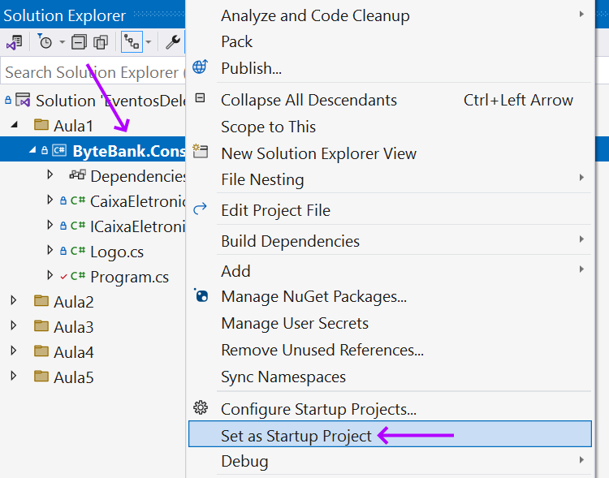

PREPARANDO O AMBIENTE - Projeto inicial

Vamos trabalhar com o projeto ByteBank durante todo este curso e para isso já temos um projeto inicial criado com o código do simulador de caixa eletrônico.

Para acompanhar os aprendizados durante as aulas e praticar tudo que formos aprendendo, você deverá baixar o Visual Studio Community ou qualquer versão gratuita ou não-gratuita do Visual Studio, através do link: [Baixar Visual Studio](https://visualstudio.microsoft.com/pt-br/).

(Obs.: não recomendamos utilizar o VS Code, pois os comandos e configurações utilizados são diferentes, e podem confundir seu aprendizado.)

Depois de baixado o Visual Studio, execute o programa: Visual Studio Installer, e clique no botão **Modificar**:

Em seguida, selecione os seguintes componentes a serem instalados:

- ASP.NET e desenvolvimento Web
- Desenvolvimento com desktop com .NET

Depois, clique no botão **Modificar**:

Uma vez que tenha instalado o Visual Studio completamente, é a vez de baixar o código do repositório do GitHub.

Para acompanhar os aprendizados durante as aulas e praticar tudo que formos aprendendo, você deverá fazer o [download do projeto no repositório](https://github.com/marcelooliveira/4095-eventos-delegates-lambdas).  

Agora abra o diretório local e localize as pastas contendo o código das aulas:

Faça um duplo-clique no arquivo `EventosDelegatesLambdas.sln` para abrir a solução do curso no Visual Studio.

Em seguida, abra a pasta da solução **Aula1** e, mova o mouse sobre o projeto **ByteBank.Console** e clique com o botão direito do mouse. Em seguida, clique no menu **Set as startup project** (Definir como projeto de inicialização):

Agora execute o projeto da Aula 1 com o botão F5, ou abra o menu **Debug** e escolha **Start Debugging**. Isso iniciará a aplicação console do ByteBank com o menu inicial:

Então escolha as opções do menu: 1, 2, 3, e 4, nesta ordem, para executar as operações de saldo, depositar valores, sacar valores, e extrato bancário, respectivamente:

Pronto! Agora você já pode começar o curso! 

Bons estudos!
