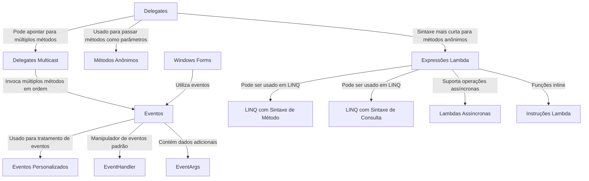

```mermaid
graph TD

A[Delegates] -->|Pode apontar para múltiplos métodos| B[Delegates Multicast]
A -->|Usado para passar métodos como parâmetros| C[Métodos Anônimos]
A -->|Sintaxe mais curta para métodos anônimos| D[Expressões Lambda]
B -->|Invoca múltiplos métodos em ordem| F[Eventos]
F -->|Usado para tratamento de eventos| G[Eventos Personalizados]
F -->|Manipulador de eventos padrão| H[EventHandler]
F -->|Contém dados adicionais| I[EventArgs]
D -->|Pode ser usado em LINQ| J[LINQ com Sintaxe de Método]
D -->|Pode ser usado em LINQ| K[LINQ com Sintaxe de Consulta]
D -->|Suporta operações assíncronas| L[Lambdas Assíncronas]
D -->|Funções inline| M[Instruções Lambda]
N[Windows Forms] -->|Utiliza eventos| F
```