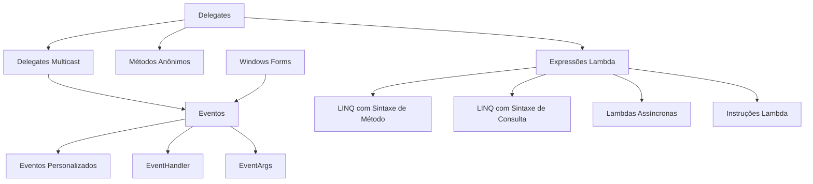

```mermaid
graph TD

A[Delegates] --> B[Delegates Multicast]
A --> C[Métodos Anônimos]
A --> D[Expressões Lambda]
B --> F[Eventos]
F --> G[Eventos Personalizados]
F --> H[EventHandler]
F --> I[EventArgs]
D --> J[LINQ com Sintaxe de Método]
D --> K[LINQ com Sintaxe de Consulta]
D --> L[Lambdas Assíncronas]
D --> M[Instruções Lambda]
N[Windows Forms] --> F
```